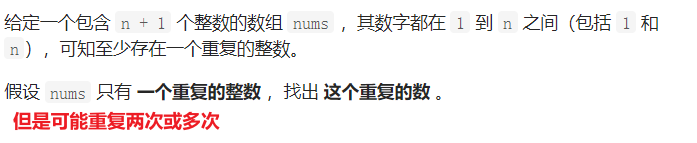
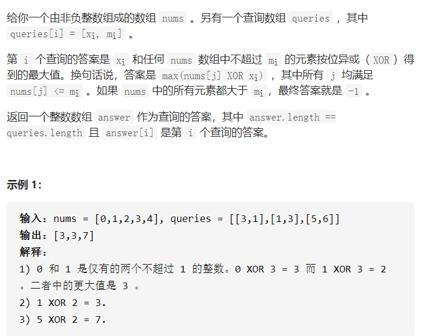
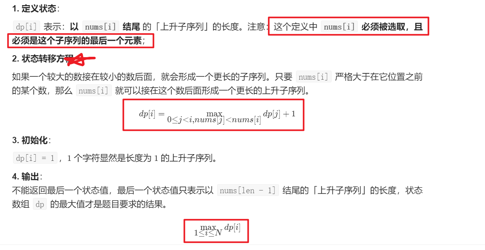
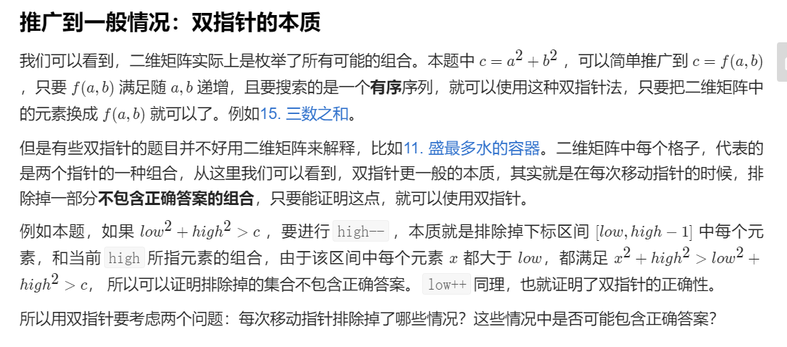
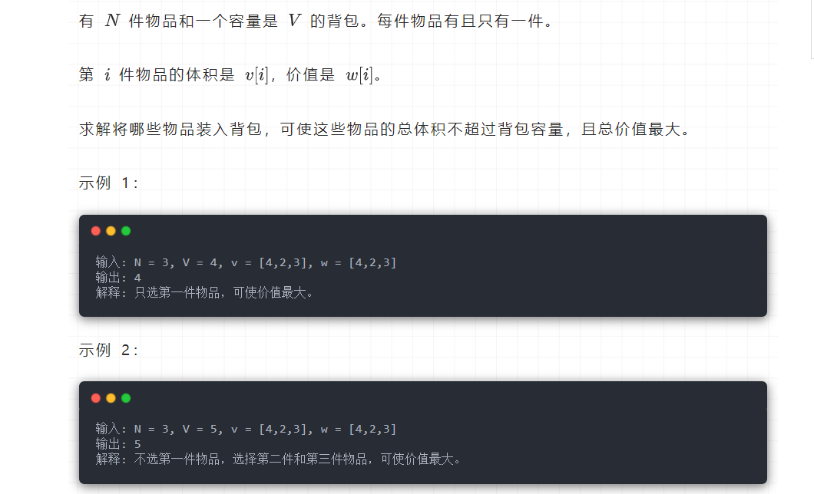
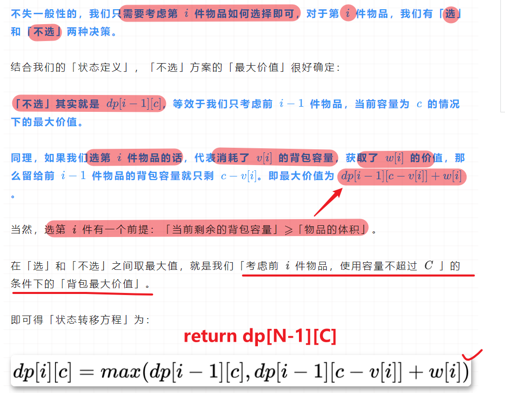
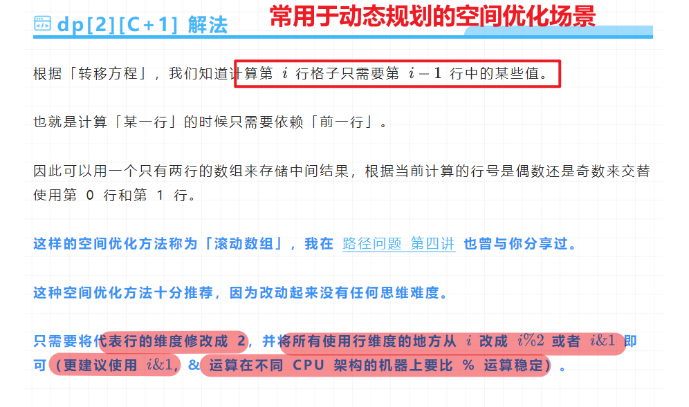

# VScode上的刷题笔记
用来记录`leetcode`的刷题笔记

# 题型分类
## 辅助栈解法
### 直方图的水量：
1. 单调栈解法[0,1,0,2,1,0,1,3,2,1,2,1],维护一个栈，使得栈内元素单调递增或者递减。本题为递减。那么，当一个新的元素需要插入的时候，如果它比栈顶元素大，那么这时候可以盛水.此时盛水容量为(index - top `- 1`) * (min(height[index], height[top--]) - height[top])
    ```c++
    test
    ```

2. [二叉搜索树的后序遍历序列](https://leetcode-cn.com/problems/er-cha-sou-suo-shu-de-hou-xu-bian-li-xu-lie-lcof/)
   
    > 单调栈法的原理：
    > 先将根右的节点逐个放入，并且除了第一个根节点外，
    > 若右子树存在，应当是一个单调递增的序列。当出现元素小于top的时候，这个值是右子树某个根节点的左节点，
    > 这时候，这个节点及其后面的所有元素值都应该小于他的根节点。
    > 因为其他的元素值要么是挂载在他的左边，要么就是在他的根节点的父节点的左子节点。
    > 那么找到此时的栈内元素中最后一个大于他的值，就是他的根节点root
    > 对于如果其他元素谁大于这个值（false）
    > 否则都进行push，并且再push的过程中都需要和栈顶元素比较
    ```c++
    stack<int> st;
        int root = INT_MAX;
        for(int i = postorder.size() - 1; i >= 0; --i)
        {
            if(postorder[i] > root) return false;
            while(!st.empty() && postorder[i] < st.top())
            {
                root = st.top();
                st.pop();
            }
            st.push(postorder[i]);
        }
    return true;
    ```
## 原地操作（数组、字符串相关）
1. [删除有序数组中的重复项II](https://leetcode-cn.com/problems/remove-duplicates-from-sorted-array-ii/)
    > 给你一个有序数组 nums ，请你 原地 删除重复出现的元素，使每个元素 最多出现两次 ，返回删除后数组的新长度。不要使用额外的数组空间，你必须在 原地 修改输入数组 并在使用 O(1) 额外空间的条件下完成。

    ```c++
    class Solution {
    public:
        int work(vector<int>& nums, int k) {
            int len = 0;
            for(auto num : nums)
                if(len < k || nums[len-k] != num) //对前k个数字，直接保留，对于后面的任意数字，如果要写入的位置前k个元素不为num则可以写入
                    nums[len++] = num;
            return len;
        }
        int removeDuplicates(vector<int>& nums) {
            return work(nums, 2);
        }
    };
    
    //c++迭代器版本:vector<T>.erase()的使用
      
    ```

2. 简洁版：[删除有序数组中的重复项]
    > 使用[双指针的解法](https://leetcode-cn.com/problems/remove-duplicates-from-sorted-array/solution/shuang-zhi-zhen-shan-chu-zhong-fu-xiang-dai-you-hu/)利用两个指针，一个指针维护新数组的下标。另一个指针负责遍历全部元素
    ```c++
    //c++迭代器版本
    class Solution {
    public:
        int removeDuplicates(vector<int>& nums) {
            vector<int>::iterator iter1 = nums.begin();
            for(; iter1 != nums.end(); iter1 ++){
                if( iter1 != nums.begin() && *iter1 == *(iter1 - 1)){
                    nums.erase(iter1);
                    iter1--;
                }
            }
            return nums.size();
        }
    };
    ```

3. vivo面试题：字符串数组中所有字符串的最长公共前缀

   > 给定一个字符串数组strs[str1, str2, str3,...]，求公共前缀。
   >
   > **思路1：所有字符串的公共前缀长度一定小于等于任意两个字符串的公共前缀长度。因此可以维护一个指针，用来指向第一个字符串的子串位置。并且根据遍历结果，逐步修改（减小）**
   >
   > ```c++
   > string longestCommonPrefix(vector<string>& strs) {
   >     int index = strs[0].length(); //默认公共前缀长度为第一个字符串的长度
   >     for(int i = 1; i < strs.size(); i++)
   >     {
   >         index = min(index, (int)strs[i].size());
   >         for(int j = 0; j < index; j++)
   >         {
   >             if(strs[0].at(j) == strs[i].at(j)) continue;
   >             else
   >             {
   >                 index = j;
   >                 break;
   >             }
   >         }
   >     }
   >     return strs[0].substr(0, index);
   > }
   > ```
   >
   > **思路2：前缀树**

### 二分查找的基本写法
> 要求数组元素有序排列。对于二分查找法写闭区间即[left, right]
> 
> 这样写的一个好处是，如果需要取nums[right]可以避免出现非法访问的问题。
```c++
int left = 0, right = nums.size() - 1;
int mid = 0, res = ...;
while(left <= right)
{
    mid = left + (right - left)/2;
    if(nums[mid] == target) return mid;
    else if(nums[mid] < target) left = mid + 1;
    else if(nums[mid] > target) right = mid - 1;
}

//最后需要进行边界值判断，while终止条件为left > right
if(left == nums.size()) return -1; //没有找到
return left(or right);
```

### **二分查找注意事项**
1. 类似于旋转数组题型，需要对`mid,left,right`的值进行比较，因此，当最后剩下两个元素的时候，`mid = left导致nums[left] = nums[mid]`因此需要`>=` **见搜索旋转排序数组**
### 常见题型
1. [寻找旋转排序数组中的最小元素](https://leetcode-cn.com/problems/find-minimum-in-rotated-sorted-array/)
    > 数组的元素各不相同，但是可能进行了k次旋转。即最后k个元素被放置到数组前端来了
    >
    > **解题思路：**
    > 
    > 1. 暴力解法。进行一个O(N)遍历，得到最小值。
    > 2. 二分搜索法：代码如下
    ```c++
    //分析：比较mid和left以及right的关系，并且每次都记录min(mid, curMin)
    //1. left < mid < right ,缩小right
    //2. left > mid, mid < right, 缩小right
    //3. left < mid, mid > right, 改变left，这时候旋转点在后半部分
    //4. left > mid > right; 改变left
    int left = 0, right = nums.size() - 1;
        int mid = 0, minNum = 5000;
        while(left <= right) //全封闭区间解法
        { 
            mid = left + (right - left) / 2;
            minNum = min(minNum, nums[mid]);
            if(nums[mid] < nums[right]) //前半部分有序
            {
                right = mid - 1;
            }
            else
            {
                left = mid + 1;
            }
        }
    
    return minNum;
    
    //左闭右开的区间写法
    int left = 0, right = nums.size();
        int mid = 0, minNum = 5000;
        while(left < right)
        { 
            mid = left + (right - left) / 2;
            minNum = min(minNum, nums[mid]);
            if(nums[mid] <= nums[right - 1]) //前半部分有序
            {
                right = mid;
            }
            else
            {
                left = mid + 1;
            }
        }
    return minNum;
    
    ```
    
2. 变种：搜索最大元素呢？
    ```c++
    int left = 0, right = nums.size() - 1;
    int mid = 0;
    while(left < right) //终止条件为left = right
    {
        mid = left + (right - left)/2;
        if(nums[left] < nums[mid]) left = mid;
        else right = mid - 1;
    }
      
    return nums[(right + 1)% nums.size()]; //最大值在最右边
   ```
   
3. [寻找旋转排序数组中的最小值II](https://leetcode-cn.com/problems/find-minimum-in-rotated-sorted-array-ii/)
    > 在原有基础上，元素可能存在重复
    ```c++
    //暴力解法：O(N)循环遍历
    int findMin(vector<int>& nums) {
        int res = nums[0]; //这里初值要么为最大元素值，要么赋值为第一个元素值
        for(int i : nums)
        {
            res = min(res, i);
        }
        return res;
    }
    //二分查找法
    //全封闭区间解法
    int left = 0, right = nums.size() - 1;
    int mid = 0, minNum = INT_MAX;
    while(left <= right){
        mid = left + (right - left)/2;
        minNum = min(minNum, nums[mid]);
        while(nums[mid] == nums[right] && mid < right) right--; //跳过相同元素
        if(mid == right){ //需要对while的两个终止条件做判断
            right = mid - 1;
        }
        else{ 
            if(nums[mid] < nums[right]) right = mid -1; //while条件终止的第二种情形
            else left = mid + 1;
        } 
    }
    
    return minNum;
    
    //左闭右开区间写法
    int left = 0, right = nums.size();
    int mid = 0, res = INT_MAX;
    while(left < right)
    {
        mid = left + (right - left)/2;
        res = min(res, nums[mid]);
        while(nums[mid] == nums[right - 1] && mid < right-1) right--;
        if(mid == right - 1){
            right = mid;
        }
        else{
            if(nums[mid] < nums[right - 1]) right = mid;
            else left = mid + 1; //mid + 1 != right
        }
    }
    return res;    
    ```

4. [搜索旋转排序数组II](https://leetcode-cn.com/problems/search-in-rotated-sorted-array-ii/)
    > 寻找一个有重复元素，原本有序排列，但是在某个位置进行翻转后的数组中是否有`target`的存在
    > 简单版本就是`没有重复元素`

    ```C++
    //代码示例：
    //1. 暴力解法:O(N)
    //2. 二分搜索法要点：对于重复元素的处理手段，单步递增或递减
    ```

5. [搜索旋转排序数组](https://leetcode-cn.com/problems/search-in-rotated-sorted-array/)
    ```c++
    
    int left = 0, right = nums.size() - 1;
    int mid = 0;
    while(left <= right)
    {
        mid = left + (right - left)/2;
        if(nums[mid] == target) return mid;
        
        if(nums[mid] >= nums[left]) //注意这里,最后两个数的时候mid = left,因此nums[mid] = nums[left]
        {
            if(nums[mid] > target && target >= nums[left]) right = mid - 1;
            else left = mid + 1;
        }
        else
        {
            if(nums[mid] < target && target <= nums[right]) left = mid + 1;
            else right = mid - 1;
        }
    }
    
    return -1;
    ```
    
6. [面试题：搜索旋转数组](https://leetcode-cn.com/problems/search-rotate-array-lcci/)
    ```c++
    //二分解法
    ```

7. [在排序数组中查找元素的第一个和最后一个位置](https://leetcode-cn.com/problems/find-first-and-last-position-of-element-in-sorted-array/)
   
    > 如果没有找到，返回-1，如果只有一个元素，就返回相同的索引。
    
8. [寻找重复数](https://leetcode-cn.com/problems/find-the-duplicate-number/)

    

    > **思路1：**原地修改法，将`abs(nums[i]) - 1`下标对应的元素修改为负值。如果该下次检测到该下标对应的元素为负，那么`abs(nums[i])`就是一个重复元素
    >
    > **思路2：**排序后使用异或
    >
    > **思路3：**二分查找法，mid取为数值区间的中点。如果数组中小于mid的数字个数大于等于mid，那么重复数字可能出现在左半部分。
    >
    > ```c++
    > int left = 1, right = nums.size() - 1;
    > while(left < right)
    > {
    >     int mid = left + (right - left + 1)/2; //1-7的第一个mid为4
    >     int cnt = 0;
    >     for(int num: nums)
    >     {
    >         if(num < mid) cnt++;
    >     }
    >     
    >     //重要~~~~~~~~
    >     if (cnt >= mid) {
    >         // 重复的元素一定出现在 [left, mid - 1] 区间里
    >         right = mid - 1;
    >     } else {
    >         // if 分析正确了以后，else 搜索的区间就是 if 的反面
    >         // [mid, right]
    >         // 注意：此时需要调整中位数的取法为上取整
    >         left = mid;
    >     }
    > }
    > ```
    
9. [平方数之和]

    > 给定一个整数c，判断是否存在两个整数在[0,c]之间的数，使得其平方和为c
    >
    > 需要考虑：
    >
    > 1. 数值溢出(0 <= c <= 2^31 - 1)，所以采用long long
    >
    > **暴力解法O(nlogN)：**
    >
    > ```c++
    > bool judgeSquareSum(int c) {
    >     if(c == 0) return true;
    >     for(long long i = 0; i < c; i++)
    >     {
    >         long long temp = c - i*i;
    >         if(temp < 0) return false;
    >         long long left = i, right = c;
    >         while(left < right)
    >         {
    >             long long mid = left + (right - left)/2;
    >             if(temp == mid*mid) return true;
    >             if(temp > mid*mid) left = mid + 1;
    >             else right = mid;
    >         }
    >         if(temp == left*left) return true;
    >     }
    > 
    >     return false;
    > }
    > ```
    >
    > 

## 二叉树相关
### 二叉树的遍历
1. [二叉搜索树的后序遍历序列](https://leetcode-cn.com/problems/er-cha-sou-suo-shu-de-hou-xu-bian-li-xu-lie-lcof/)
    > 对于二叉搜索树，满足左子树的元素值始终小于根节点的值，而右子树的值始终大于根节点的值。
    >
    > 后序遍历：左右根，导致每个子树遍历序列的最后一个元素为`根节点`
    > **分析：** 找出根节点，判断左子树的最大节点以及右子树的最小节点是否满足相关要求。
    > 
    > 相关函数：以下函数均为[first, last)
    > - lower_bound(iterator_first, iterator_last, value); //返回第一个大于等于value的下标。如果都没有则为last
    > - upper_bound(iterator_first, iterator_last, value); //返回第一个大于value的下标，如果都小于，则返回last
    > - ForwardIterator min_element (ForwardIterator first, ForwardIterator last); //默认返回合法区间的最小元素值
    > 
    > 遇到的问题：应该考虑完所有的情形
    > 1. 只有一半子树的情形[5,4,3,2,1],这时候`subLeftTree`为-1应该如何处理？**将左子树的最大值赋值为INT_MIN,右子树的最小值赋值为INT_MAX**
    > 2. 递归的条件，传入的边界值考虑

    ```c++
    bool myVerify(vector<int>& postorder, int start, int end)
    {
    //判断子树是否是二叉搜索树的后续遍历
    if(end - start <= 1) return true; //当前子树只有0或1个节点，肯定是二叉搜索树
    int root = postorder[end]; //最后一个节点一定  	 是当前子树的根节点[后序遍历的特点]
    //得到左子树的最后一个节点位置和右子树的第一个节点位置
    int subRight = start;
    for(; subRight < end; subRight++)
    {
        if(postorder[subRight] > root){
            break;
        }
    }
    //终止位置表示右子树的第一个节点位置，如果为end，那么右子树为空
    int max_Left = INT_MIN;
    int min_Right = INT_MAX;
    if(subRight > start){ //左子树不为空
        int max_Left = *max_element(postorder.begin() + start, postorder.begin() + subRight);
    }
    if(end > subRight) 
    {min_Right = *min_element(postorder.begin() + subRight, postorder.begin() + end);}  //左闭右开
    if(max_Left > root || min_Right < root) 
        return false;
    else    
        return myVerify(postorder, start, subRight - 1)&&myVerify(postorder, subRight, end - 1);
    }   
    ```

2. [二叉树的后序遍历](https://leetcode-cn.com/problems/binary-tree-postorder-traversal/)
    ```c++
    //两种实现方式
    //递归：需要注意递归终止条件
        void myPostorder(TreeNode* root, vector<int>& res){
        //后续遍历实现
        if(root == nullptr) return;
        if(root->left)
        myPostorder(root->left, res); //遍历左子树
        if(root->right)
        myPostorder(root->right, res); //遍历右子树
        res.push_back(root->val);
    
    }
    //迭代实现：
    vector<int> postorderTraversal(TreeNode* root) {
        if (!root) return {};
        vector<int> vec;
        stack<TreeNode *> stk;
        TreeNode *prev = nullptr;
        auto node = root;
        while (!stk.empty() || node) {
            // 1.遍历到最左子节点
            while (node) {
                stk.emplace(node);
                node = node->left;
            }
            node = stk.top(); stk.pop();
            // 2.遍历最左子节点的右子树(右子树存在 && 未访问过)
            if (node->right && node->right != prev) {
                // 重复压栈以记录当前路径分叉节点
                stk.emplace(node);
                node = node->right;      
            } else {
                // 后序：填充vec在node->left和node->right后面
                // 注意：此时node的左右子树应均已完成访问
                vec.emplace_back(node->val);
                // 避免重复访问右子树[记录当前节点便于下一步对比]
                prev = node;
                // 避免重复访问左子树[设空节点]
                node = nullptr;
            }
        }
        return vec;
    }
    ```
    
3. [二叉树的前序遍历](https://leetcode-cn.com/problems/binary-tree-preorder-traversal/)
    > 二叉树的前序遍历为：`根左右`，因此在迭代实现的过程中，可以考虑用一个辅助栈来模拟进程。
    >
    > 先将根节点压入栈，然后压入右子树，再压入左子树，这时左子树为top，继续对左子树进行top操作

    ```c++
    void myPreorder(TreeNode* root, vector<int>& v) //递归实现
    {
        if(!root) return;
        v.push_back(root->val);
        myPreorder(root->left,v);
        myPreorder(root->right, v);
    }
    void myPreorderIterable(TreeNode* root)
    {
        //迭代实现
        if(!root) return;
        stack<TreeNode*> st;
        TreeNode* cur = root;
        st.push(cur);
        while(!st.empty())
        {
            cur = st.top();
            st.pop();
            res.push_back(cur->val);
            if(cur->right) st.push(cur->right);
            if(cur->left) st.push(cur->left);
        }
    }
    ```

4. [二叉树的中序遍历](https://leetcode-cn.com/problems/binary-tree-inorder-traversal/)
   
    > 二叉树的中序遍历顺序为：左根右
    >
    > ```c++
    > void myInorderInter(TreeNode* root) //辅助栈实现迭代
    > {
    >     if(!root) return; //判断树是否为空
    >     stack<TreeNode*> st;
    >     TreeNode* cur = root;
    >     while(!st.empty() || cur)
    >     {
    >         while(cur)
    >         {
    >             st.push(cur);
    >             cur = cur->left;
    >         }
    >         TreeNode* temp = st.top(); //这里是对栈顶元素进行操作，记录当前的值
    >         res.push_back(temp->val);
    >         st.pop();
    >         if(temp->right) cur = temp->right; //当前temp左子树为空，判断右子树是否为空，如果为空，则
    >         //cur可以实现遍历下一个栈顶元素的右子树
    >     }
    > }
    > void myInorderRecur(TreeNode* root)//递归实现
    > {
    >     if(!root) return; //递归终止条件
    >     myInorderRecur(root->left);//遍历左子树
    >     res.push_back(root->val);
    >     myInorderRecur(root->right); 
    > }
    > void myInorderColor(TreeNode* root) //颜色标记法的中序遍历
    > {
    >     if(!root) return;
    >     stack<pair<TreeNode*, int>> st;
    >     st.push(make_pair(root, 0)); //0表示第一次遍历到该节点
    >     while(!st.empty())
    >     {
    >         auto [node, color] = st.top();
    >         st.pop(); //必须pop不然会出问题
    >         if(!node) continue;
    >         if(color==0)
    >         {
    >             st.push(make_pair(node->right, 0));
    >             st.push(make_pair(node, 1));
    >             st.push(make_pair(node->left, 0));
    >         }
    >         else
    >         {
    >             res.push_back(node->val);
    >         }
    >     }
    > }
    > ```
    
5. [二叉树节点的堂兄弟](https://leetcode-cn.com/problems/cousins-in-binary-tree/)

    > 在二叉树中，根节点位于深度 0 处，每个深度为 k 的节点的子节点位于深度 k+1 处。如果二叉树的两个节点深度相同，但 父节点不同 ，则它们是一对堂兄弟节点。我们给出了具有唯一值的二叉树的根节点 root ，以及树中两个不同节点的值 x 和 y 。只有与值 x 和 y 对应的节点是堂兄弟节点时，才返回 true 。否则，返回 false
```c++
    //BFS解法：
    class Solution {
    public:
        unordered_map<int,pair<int,int>> mp; //通过一个哈希表将节点的值及层数保存下来
        bool isCousins(TreeNode* root, int x, int y) {
            queue<TreeNode*> q;
            q.push(root);
            int h = 1;
            while(q.size()){
                int n = q.size();
                for(int i = 0; i < n; i++){
                    auto t = q.front(); q.pop();
                    if(t->left) mp[t->left->val] = {t->val,h}, q.push(t->left);
                    if(t->right) mp[t->right->val] = {t->val,h}, q.push(t->right);
                }
                h++;
            }
            return mp[x].second == mp[y].second and mp[x].first != mp[y].first;
        }
    };
    
    //BFS解法2：
    class Solution {
    public:
        bool isCousins(TreeNode* root, int x, int y) {
        deque<pair<TreeNode*, int>> dq;
        pair<TreeNode*, int> xPar, yPar;
        int level = 0;
        dq.emplace_back(make_pair(root, level));
        if(root->val == x) xPar = make_pair(root, level);
        if(root->val == y) yPar = make_pair(root, level);
        while(!dq.empty())
        {
            auto temp = dq.front();
            dq.pop_front();
            level = temp.second+1;
            if(xPar.first && yPar.first) break; //剪枝
            if(temp.first->left) 
            {
                if(temp.first->left->val == x) xPar = temp;
                if(temp.first->left->val == y) yPar = temp;
                dq.emplace_back(make_pair(temp.first->left, level));
            }
            if(temp.first->right)
            {
                if(temp.first->right->val == x) xPar = temp;
                if(temp.first->right->val == y) yPar = temp;
                dq.emplace_back(make_pair(temp.first->right, level));
            }
        }
        return xPar.second == yPar.second && xPar.first->val != yPar.first->val;
        }
    };
    
    //DFS解法
    vector<int> dfs(TreeNode* root, TreeNode* parent, int val, int hei)
    {
    	if(root == nullptr) return {-1, -1};
        if(root->val == val) 
            return {parent != nullptr? parent->val:1, hei};
        vector<int> leftV = dfs(root->left, root, val, hei+1);
        if(leftV[0] != -1) return leftV;
        return dfs(root->right, root, val, hei+1);
    }
```


### 二叉树的深度

1. [计算二叉树的深度](https://leetcode-cn.com/problems/er-cha-shu-de-shen-du-lcof/solution/mian-shi-ti-55-i-er-cha-shu-de-shen-du-xian-xu-bia/)

> BFS的算法解析：
>
> **关键点：** 每遍历一层，则计数器 +1+1 ，直到遍历完成，则可得到树的深度。

**算法解析：**

- 特例处理： 当 root 为空，直接返回 深度 0 。
- 初始化： 队列 queue （加入根节点 root ），计数器 res = 0。
- 循环遍历： 当 queue 为空时跳出。
- 初始化一个空列表 tmp ，用于临时存储下一层节点；
- 遍历队列： 遍历 queue 中的各节点 node ，并将其左子节点和右子节点加入 tmp；
- 更新队列： 执行 queue = tmp ，将下一层节点赋值给 queue；
- 统计层数： 执行 res += 1 ，代表层数加 11；
- 返回值： 返回 res 即可。

```c++
//DFS实现
int maxDepth(TreeNode* root) {
    if(!root) return 0;
    int height = 1;
    return height + max(maxDepth(root->left), maxDepth(root->right));
}

//BFS实现
int maxDepth(TreeNode* root) {
    // if(!root) return 0;
    // int height = 1;
    // return height + max(maxDepth(root->left), maxDepth(root->right));
    if(!root) return 0;
    deque<TreeNode*> dq;
    int res = 0;
    dq.push_back(root);
    while(!dq.empty())
    {
        deque<TreeNode*> tempQue;  
        for(auto & node: dq) //容器遍历的新手段，还不需要创立对象，代码也简洁
        {
            if(node->left)  tempQue.push_back(node->left);
            if(node->right)  tempQue.push_back(node->right);
        }
        res++;
        dq = tempQue;
    }

    return res;
}
```

2. [平衡二叉树](https://leetcode-cn.com/problems/ping-heng-er-cha-shu-lcof/)

   > 输入一棵二叉树的根节点，判断该树是不是平衡二叉树。如果某二叉树中任意节点的左右子树的深度相差不超过1，那么它就是一棵平衡二叉树。
   >
   > **递归细节：**最开始只想到判断两边子树的深度是否满足条件，而没有添加`isBalanced(root->left) && isBalanced(root->right);`来判断每个子树的平衡情况

   ```c++
   bool isBalanced(TreeNode* root) {
           if(!root) return true;
           return abs(getHeight(root->left) - getHeight(root->right)) <= 1 && isBalanced(root->left) && isBalanced(root->right);
       }
   
   private:
       int getHeight(TreeNode* root)
       {
           if(!root) return 0;
           return 1 + max(getHeight(root->left), getHeight(root->right));
       }
   
   //大佬的进阶版：剪枝替代重复的运算
   
   ```

### 距离问题

1. [二叉搜索树节点最小距离](https://leetcode-cn.com/problems/minimum-distance-between-bst-nodes/)

   > 给你一个二叉搜索树的根节点 `root` ，返回 **树中任意两不同节点值之间的最小差值** 。
   >
   > **思路：二叉搜索树的中序遍历结果是一个有序序列！！！**
   >
   > 可以通过一个中序遍历得到序列，并且判断相邻元素之间的差值找到最小值

   ```c++
   class Solution {
   public:
       int minDiffInBST(TreeNode* root) {
           //BFS
           myInorderInter(root);
           int minRes = INT_MAX;
           for(int i = res.size()-1; i>=1; --i)
           {
               res[i] -= res[i-1];
           } //这里直接原地计算差值，并且取后n-1个值中最小值min_element也要求有序性
           return *min_element(res.begin()+1, res.end());
       }
   
   private:
       vector<int> res;
       void myInorderInter(TreeNode* root) //辅助栈实现迭代
       {
           if(!root) return; //判断树是否为空
           stack<TreeNode*> st;
           TreeNode* cur = root;
           while(!st.empty() || cur)
           {
               while(cur)
               {
                   st.push(cur);
                   cur = cur->left;
               }
               TreeNode* temp = st.top(); //这里是对栈顶元素进行操作，记录当前的值
               res.push_back(temp->val);
               st.pop();
               if(temp->right) cur = temp->right; //当前temp左子树为空，判断右子树是否为空，如果为空，则
                                                   //cur可以实现遍历下一个栈顶元素的右子树
           }
       }
   };
   ```

   > 思路2：由于最小值出现在当前节点和下一个节点之间的差值最小情形。因此增加一个`pre`节点来记录上一次访问节点，默认为`nullptr`可以避免第一次的非法操作

### 二叉树的最近公共祖先


### 搜索

### 相关题型

1. [第n个丑数](https://leetcode-cn.com/problems/ugly-number-ii/)

   > 解法:
   >
   > - 优先队列法（小顶堆）+去重
   > - 直接通过set（自动去重）
   > - 动态规划法：[三指针法](https://leetcode-cn.com/problems/ugly-number-ii/solution/san-zhi-zhen-fang-fa-de-li-jie-fang-shi-by-zzxn/)

   ```c++
   //第n个丑数
   int Solution::nthUglyNumber(int n) {
       //最大堆法
       priority_queue <double,vector<double>,greater<double> > q;
       double answer=1;
       for (int i=1;i<n;++i)
       {
           q.push(answer*2);
           q.push(answer*3);
           q.push(answer*5);
           answer=q.top();
           q.pop();
           while (!q.empty() && answer==q.top())
               q.pop();
       }
       return answer;
       //采用set去重的方法
       priority_queue <double,vector<double>,greater<double> > q;
       set<int> s;
       s.insert(1);
       vector<int> mask({2,3,5});
       double answer=1;
       for (int i=1;i<n;++i)
       {
           for (int &j:mask)
               if (s.count(answer*j)==0)
               {
                   q.push(answer*j);
                   s.insert(answer*j);
               }
           answer=q.top();
           q.pop();
       }
       return answer;
       //优化：直接采用set
       set<double> s;  // set 是有序的，且不重复
       double answer = 1;
       for (int i = 1; i < n; i++) {
           s.insert(answer * 2);
           s.insert(answer * 3);
           s.insert(answer * 5);
           answer = *s.begin();
           s.erase(answer);
       }
       return answer;
   
       //三指针解法
       int p2 = 0, p3 = 0, p5 = 0;
       vector<double> res(n, 0);
       res[0] = 1;
       for(int i = 1; i < n; i++)
       {
           double arr[] = {2*res[p2], 3*res[p3], 5*res[p5]};
           int temp = int(*min_element(arr, arr+3));
           res[i] = temp;
           if(temp == arr[0]) p2++;
           if(temp == arr[1]) p3++;
           if(temp == arr[2]) p5++;
       }
   
       return res[n-1];
   }
   ```

## 字符串匹配问题

1. [最长回文子串](https://leetcode-cn.com/problems/longest-palindromic-substring/solution/xiang-xi-tong-su-de-si-lu-fen-xi-duo-jie-fa-bao-gu/)

   > **解法1：暴力解法：对每种可能性进行遍历，并且保留长度最大者**
   >
   > ```java
   > class Solution {
   > public:
   >     string longestPalindrome(string s) {
   >         string res="";//存放结果
   >         string temp="";//存放子串
   >         for(int i=0;i<s.length();i++)
   >         {
   >             for(int j=i;j<s.length();j++)
   >             {
   >                 temp=temp+s[j]; //起点相同时，每次多增加一个元素
   >                 string tem=temp;//tem存放子串反转结果
   >                 std::reverse(tem.begin(),tem.end());//反转
   >                 if(temp==tem)
   >                     res=res.length()>temp.length()?res:temp;
   >             }
   >             temp="";
   >         }
   >         return res;
   >     }
   > };
   > ```
   >
   > **解法2：DP**
   >
   > ```c++
   > class Solution {
   > public:
   >     string longestPalindrome(string s) {
   >         int len=s.size();
   >         if(len==0||len==1)
   >             return s;
   >         int start=0;//回文串起始位置
   >         int max=1;//回文串最大长度
   >         vector<vector<int>>  dp(len,vector<int>(len));//定义二维动态数组
   >         for(int i=0;i<len;i++)//初始化状态
   >         {
   >             dp[i][i]=1;
   >             if(i<len-1&&s[i]==s[i+1])
   >             {
   >                 dp[i][i+1]=1;
   >                 max=2;
   >                 start=i;
   >             }
   >         }
   >         for(int l=3;l<=len;l++)//l表示检索的子串长度，等于3表示先检索长度为3的子串
   >         {
   >             for(int i=0;i+l-1<len;i++)
   >             {
   >                 int j=l+i-1;//终止字符位置
   >                 if(s[i]==s[j]&&dp[i+1][j-1]==1)//状态转移
   >                 {
   >                     dp[i][j]=1;
   >                     start=i;
   >                     max=l;
   >                 }
   >             }
   >         }
   >         return s.substr(start,max);//获取最长回文子串
   >     }
   > };
   > ```
   >
   > 

## 位运算
### 二进制的源码、补码、反码
1. 补码：在补码表示中，最高位为符号位，`0正1负`

2. 原码：最高位为符号位，其他位相同

3. 正整数的补码是其二进制表示，与原码相同

4. 求负整数的补码，将其原码除符号位外的所有位取反（0变1，1变0，符号位为1不变）后加1

4. 已知一个数的补码，求原码的操作其实就是对该补码再求补码
    > 对于数-5原码：10000101, 补码：11111011
    > 已知一个补码为11111001，则原码是10000111（-7）
    
6. `&&`逻辑与的特性：短路原理

    ```c++
    //求1+2+3+...+n
    int sumNums(int n) {
        // //牛
        // bool arr[n][n+1];
        // return sizeof(arr)>>1;
        n && (n += sumNums(n-1)); //递归实现，终止条件为n == 1;
        return n;
    }
    ```

7. 异或的可交换性：`1^2^3^4 = 1^3^2^4`

    > 作用：找到只重复一次的元素。
    
8. 异或的运算

    > - X^0 = X
    > - X^1 = ~X
    > - X^X = 0

### 相关题型：

1. [只出现一次的数字II](https://leetcode-cn.com/problems/single-number-ii/)

   > **思路1：朴素解法，先排序后判断**
   >
   > ```c++
   > int singleNumber(vector<int>& nums) {
   >     //因为nums[i]为整个int数值范围，因此原地修改法不行
   >     if(nums.size() == 1) return nums[0]; //当nums.size() == 1时，可能
   >     sort(nums.begin(), nums.end());
   >     for(int i = 0; i < nums.size() - 2; )
   >     {
   >         if(nums[i] == nums[i + 1]) i+=3;
   >         else return nums[i];
   >     }
   > 
   >     return nums[nums.size() - 1];
   > }
   > ```
   >
   > **思路2：使用一个长度为 32 的数组 cnt[] 记录下所有数值的每一位共出现了多少次 11，再对 cnt[] 数组的每一位进行 mod 33 操作，重新拼凑出只出现一次的数值。**
   >
   > ```c++
   > ```
   >
   > 

## 前缀树

Trie（发音类似 "try"）或者说 前缀树 是一种树形数据结构，用于高效地存储和检索字符串数据集中的键。这一数据结构有相当多的应用情景，例如自动补完和拼写检查。

https://leetcode-cn.com/problems/implement-trie-prefix-tree/solution/trie-tree-de-shi-xian-gua-he-chu-xue-zhe-by-huwt/

### 题型及其应用

1. [实现Trie](https://leetcode-cn.com/problems/implement-trie-prefix-tree/)

   - Trie() 初始化前缀树对象。
   - void insert(String word) 向前缀树中插入字符串 word 。
   - boolean search(String word) 如果字符串 word 在前缀树中，返回 true（即，在检索之前已经插入）；否则，返回 false 。
   - boolean startsWith(String prefix) 如果之前已经插入的字符串 word 的前缀之一为 prefix ，返回 true ；否则，返回 false 。

   ```c++
   class Trie {
   private:
       bool isEnd;
       Trie* next[26];
   public:
       Trie() {
           isEnd = false;
           memset(next, 0, sizeof(next));
       }
       
       void insert(string word) {
           Trie* node = this;
           for (char c : word) {
               if (node->next[c-'a'] == NULL) {
                   node->next[c-'a'] = new Trie();
               }
               node = node->next[c-'a'];
           }
           node->isEnd = true; //成功插入当前字符串
       }
       
       bool search(string word) {
           Trie* node = this;
           for (char c : word) {
               node = node->next[c - 'a'];
               if(node == nullptr)
                   return false;
           }
           return node->isEnd;
       }
       
       bool startsWith(string prefix) {
           Trie* node = this;
           for (char c : prefix) {
               node = node->next[c - 'a'];
               if(node == nullptr)
                   return false;
           }
           return true;
       }
   };
   ```

2. 身份证号的匹配问题

   ```c++
   /*
   对于十八位身份证号码，号码为0-9的数字排列。如果两个人的身份证号码
   前k位完全一致，k+1位不同。那么相似度为k。
   给定一个身份证库，判断给定身份证和库中的最大相似度，并输出相似度为该值人数
   */
   #include <iostream>
   #include <vector>
   #include <string>
   #include <cstring>
   
   using namespace std;
   
   class Trie{
   private:
       Trie* next[10];
       bool isEnd;
       int number;
       void genTree(string& str)
       {
           Trie* node = this;
           node->number++; //数据库的数据条数
           for(char ch: str)
           {
               if(node->next[ch - '0'] == nullptr) node->next[ch - '0'] = new Trie();
               node->next[ch - '0']->number++; //当前插入的number个数
               node = node->next[ch - '0'];
           }
           node->isEnd = true;
       }
   public:
       Trie(){
           isEnd = false;
           number=0;
           memset(next, 0, sizeof(next));
       }
       void genData(vector<string>& data)
       {
           int data_cnt = data.size();
           for(string& str: data)
           {
               genTree(str);
           }
       }
   
       pair<int, int> findSimilarity(string& str)
       {
           Trie* node = this;
           int res = 0, num = node->number;
           for(char ch : str)
           {
               node = node->next[ch - '0'];
               if(node == nullptr) break;
               res++; //相似度
               num = node->number; //相似个数
           }
           return {res, num};
       }
   };
   
   void test()
   {
       int T = 0; //数据条数
       // cin >> T;
       // vector<string> data(T);
       // for(int i = 0; i < T; i++)
       // {
       //     cin >> data[i];
       // }
       vector<string> data{"333333333333333333", "111111122222222222", "111111133333333333"};
       Trie myTrie;
       myTrie.genData(data);
       cout << "please input the ID: \"111111111000000000\"";
       string testStr = "111111111000000000";
       // cin >> testStr;
       auto res = myTrie.findSimilarity(testStr);
       cout << "similarity: " << res.first << ",num of similar: " << res.second << endl;
   
       cout << "please input the ID: \"000000000000000000\"";
       testStr = "000000000000000000";
       // cin >> testStr;
       res = myTrie.findSimilarity(testStr);
       cout << "similarity: " << res.first << ",num of similar: " << res.second << endl;
   }
   
   int main()
   {
       test();
   
       return 0;
   }
   ```

3. [数组中两个数的最大异或值](https://leetcode-cn.com/problems/maximum-xor-of-two-numbers-in-an-array/)

   > 给你一个整数数组 `nums` ，返回 `nums[i] XOR nums[j]` 的最大运算结果，其中 `0 ≤ i ≤ j < n` 
   >
   > **异或特性：异或相当于无进位加法，因此`nums[i] ^nums[j] <= nums[i]+nums[j]`**

   ```c++
   struct Trie
   {
       Trie* left = nullptr;
       Trie* right = nullptr;
       Trie(){}
   };
   class Solution {
       Trie* root = new Trie();
       static constexpr int digNum = 30;
   public:
       void add(int num)
       {
           Trie* cur = root;
           for(int k = digNum; k >= 0; --k)
           {
               int dig = ((num>>k)&1);
               if(dig == 0)
               {
                   if(!cur->left) cur->left = new Trie();
                   cur = cur->left; 
               }
               else
               {
                   if(!cur->right) cur->right = new Trie();
                   cur = cur->right;
               }
           }
       }
       int check(int num)
       {
           Trie* cur = root;
           int x = 0;
           for(int k = digNum; k >= 0; --k)
           {
               int dig = ((num>>k)&1);
               if(dig == 0) //当前数字最高位为0，优先匹配当前位为0的数字
               {
                   if(cur->right) cur = cur->right, x = x*2 + 1; 
                   else cur = cur->left, x = x*2;
               }
               else //当前数字的当前位为1
               {
                   if(cur->left) cur = cur->left, x = x*2 + 1;
                   else cur=cur->right, x = x*2;
               }
           }
           return x;
       }
       int findMaximumXOR(vector<int>& nums) {
           int res = 0;
           for(int i = 1; i < nums.size(); i++)
           {
               add(nums[i-1]);
               res = max(res, check(nums[i]));
           }
           return res;
       }
   };
   ```

4. [与数组中元素的最大异或值](https://leetcode-cn.com/problems/maximum-xor-with-an-element-from-array/)

   

   > **思路：先sort，并且，将query也按照查询上界的值从小到大排列。那么可以根据上界逐步维护一个前缀树。并且利用贪心算法实现一个数和数组中元素的最大异或值。**

   ```c++
   class Trie { //实现Trie数据
   private:
       const int L = 30;
       Trie *next[2] = {nullptr};
   public:
       Trie(){}
   
       ~Trie() {
           delete this->next[0];
           delete this->next[1];
       }
   
       void insert(int num) {
           Trie *root = this;
           // 2^30 = 1,073,741,824 > 1e9
           for(int i = L-1; i >= 0; i--) {
               int val = (num >> i) & 1;
               if(root->next[val] == nullptr)
                   root->next[val] = new Trie();
               root = root->next[val];
           }
       }
   
       int getMaxXor(int num) {
           Trie *root = this;
           int ans = 0;
           for(int i = L-1; i >= 0; i--) {
               int val = (num >> i) & 1;
               if(root->next[1-val] != nullptr) {
                   ans |= 1 << i;
                   val = 1-val;
               }
               root = root->next[val];
           }
           return ans;
       }
   
   };
   class Solution {
   public:
       vector<int> maximizeXor(vector<int>& nums, vector<vector<int>>& queries) {
           sort(nums.begin(), nums.end());
           for(int i = 0; i < queries.size(); i++)
               queries[i].push_back(i); //记录下当前查询在输出中的位置
           sort(queries.begin(), queries.end(), [](const auto &query1, const auto &query2) {
               return query1[1] < query2[1];
           }); //按照查询的上界从小到大排列
   
           vector<int> ans(queries.size());
           Trie *t = new Trie();
           int idx = 0, n = nums.size();
           for(auto &q : queries) {
               int x = q[0], limit = q[1], qid = q[2];
               while(idx < n && nums[idx] <= limit)
                   t->insert(nums[idx++]); //已经插入的值
               if(idx == 0)
                   ans[qid] = -1;
               else
                   ans[qid] = t->getMaxXor(x);
           }
           return ans;
       }
   };
   ```

   

## 动态规划

> 动态规划常见字眼：最长，最大

### 相关题型

1. [最长递增子序列](https://leetcode-cn.com/problems/longest-increasing-subsequence/)

   > 给你一个整数数组 nums ，找到其中最长严格递增子序列的长度。
   >
   > 子序列是由数组派生而来的序列，删除（或不删除）数组中的元素而不改变其余元素的顺序。例如，[3,6,2,7] 是数组 [0,3,1,6,2,2,7] 的子序列。
   >
   > 
   >
   > ```c++
   > int lengthOfLIS(vector<int>& nums) {
   >     int len = nums.size();
   >     if (len < 2) {
   >         return len;
   >     }
   >     vector<int> dp(len, 1);
   >     for (int i = 1; i < len; i++) {
   >         for(int j = 0; j < i; j++)
   >         {
   >             if(nums[j] < nums[i]) dp[i] = max(dp[i], dp[j] + 1);
   >         }
   >     }
   >     return *max_element(dp.begin(), dp.end());
   > }
   > 
   > //优化版本
   > int lengthOfLIS(vector<int> &nums) {
   >     int len = nums.size();
   >     if (len < 2) {
   >         return len;
   >     }
   >     vector<int> tail;
   >     tail.push_back(nums[0]);
   >     // tail 结尾的那个索引
   >     int end = 0;
   > 
   >     for (int i = 1; i < len; ++i) {
   >         if (nums[i] > tail[end]) {
   >             tail.push_back(nums[i]);
   >             end++; //插入的元素个数
   >         } 
   >         else {
   >             auto insertPos = lower_bound(tail.begin(), tail.end(), nums[i]);
   >             tail[insertPos - tail.begin()] = nums[i];
   >         }
   >     }
   >     return end + 1;
   > }
   > ```

2. [最大整除子集](https://leetcode-cn.com/problems/largest-divisible-subset/)

   > 参考最大增加子序列
   >
   > ```c++
   > vector<int> largestDivisibleSubset(vector<int>& nums) {
   >     using PII = pair<int, int>; //typedef
   >     sort(nums.begin(), nums.end());
   >     int n = nums.size();
   >     vector<PII> dp(n);        
   >     for(int i = 0; i < n; i++) {
   >         PII rec = {1, i}; //下标i的序列长度和下标
   >         for(int j = 0; j < i; j++)
   >             if(nums[i] % nums[j] == 0 &&  dp[j].first + 1 > rec.first)
   >                 rec = {dp[j].first+1, j}; //记录当前长度和前一个数字的下标
   >         dp[i] = rec; //最大值
   >     }
   >     int idx = max_element(dp.begin(), dp.end()) - dp.begin(); //找到最大长度的结尾
   >     int val = dp[idx].first; //找到最大长度值
   > 
   >     vector<int> ans;
   >     while(val--) { //恢复序列
   >         ans.push_back(nums[idx]); 
   >         idx = dp[idx].second;
   >     }
   >     return ans;
   > }
   > ```

3. [整数拆分](https://leetcode-cn.com/problems/integer-break/)

   > **思路1：记忆化递归**
   >
   > ```c++
   > class Solution {
   > public:
   >     int integerBreak(int n) {
   >         vector<int> record(n+1, 1);
   >         
   >         return dfs(record, n);
   >     }
   > private:
   >     int dfs(vector<int>& record, int n) {
   >         int res = 1;
   >         if (n == 1 || n == 2 || record[n] != 1) { //剪枝
   >             return record[n];
   >         } 
   >         else 
   >         {
   >             res = 0;
   >             for (int j = n - 1; j >= (n/2); --j) {
   >                  res = max(res,max(j * (n-j),max(j, dfs(record, j))*max(dfs(record, n-j), n-j)));//这里不能将j*(n-j)单独赋值给res
   >             }
   >             record[n] = res;
   >         }
   >         return record[n];
   >     }
   > };
   > 
   > ```

### 股票买卖系列

https://leetcode-cn.com/circle/article/qiAgHn/

> 最重要的基本状态`dp[i][k][0或1]：第i的最大收益`
>
> 1. 首先，明确股票交易的规则，可以是`购买、出售、休息`那么，购买表示当前拥有一支股票`dp[i][k][1]`而出售表示当前状态为`dp[i][k][0]`,而休息时，当前状态等于`i-1`的状态。
>
> 2. 并且，进行一次购买操作以后，可交易次数`k--`
>
> 3. 可以得到如下的通用状态转换方程
>
>    ```c++
>    T[i][k][0] = max(T[i - 1][k][0], T[i - 1][k][1] + prices[i]);
>    T[i][k][1] = max(T[i - 1][k][1], T[i - 1][k - 1][0] - prices[i]); //第二项表示进行了一次购买操作，那么当前收益就是在k-1次交易后的基础上进行的
>    ```
>
> 4. 所有题型均在此基础上变种，并可以考虑进行空间优化。
>
>    - k = 1
>    - k = 2
>    - k = $\infin$
>    - 有冻结时间等
>
> 5. **需要注意的是，初始状态如下**
>
>    - `dp[-1][k][0] = 0`
>    - `dp[-1][k][1] = -prices[0]  `
>    - `dp[i][0][0] = 0`
>    - `dp[i][0][1] = -prices[0] `

1. [买卖股票的最佳时机](https://leetcode-cn.com/problems/best-time-to-buy-and-sell-stock/)

   > **思路1：暴力搜索法**
   >
   > ```c++
   > //暴力搜索法O(N^2), 超时
   > int profit = 0;
   > for(int i = 0; i < prices.size(); i++)
   >     for(int j = i + 1; j < prices.size(); j++)
   >     {
   >         profit = max(profit, prices[j] - prices[i]);
   >     }
   > return profit;
   > 
   > //改进的暴力搜索法O(NlogN),超时
   > int maxProfit(vector<int>& prices) {
   >     //暴力搜索法, 超时
   >     int profit = 0;
   >     for(int i = 0; i < prices.size(); i++)
   >         profit = max(profit, *max_element(prices.begin() + i, prices.end()) - prices[i]);
   >     return profit;
   > }
   > ```
   >
   > **思路2：动态规划**
   >
   > 第i天可能的状态：持有股票或者还没有买股票，那么此时的收益的是负的



### 题型

1. [平方数之和](https://leetcode-cn.com/problems/sum-of-square-numbers/)

   > 思路1：枚举法O(sqrt(c))
   >
   > 原理：因为$a = b^{2} + c^{2}$,那么b,c的大小一定是小于等于$\sqrt c$
   >
   > ```c++
   > bool judgeSquareSum(int c) {
   >     //枚举法
   >     int upper = sqrt(c); //a，b的范围不会超过[0, sqrt(c)]
   >     for(int i = 0; i <= upper; i++)
   >     {
   >         int b = sqrt(c - i*i);
   >         if(i*i + b*b == c) return true;
   >     }
   > 
   >     return false;
   > }
   > ```
   >
   > **思路2：**双指针
   >
   > ```c++
   > bool judgeSquareSum(int c) {
   >     //枚举法
   >     long long upper = (int)sqrt(c); //a，b的范围不会超过[0, sqrt(c)]
   >     int left = 0;
   >     while(left <= upper) //并且两个数可以重复
   >     {
   >         long long cur = left*left + upper*upper; //cur有可能越界
   >         if(cur == c) return true;
   >         else if(cur > c) upper--;
   >         else left++;
   >     }
   >     return false; 
   > }
   > ```


## 整数操作问题

1. [整数反转](https://leetcode-cn.com/problems/reverse-integer/)

   ```c++
   //要点：对于负数求余数，所得余数也带有负号
   class Solution {
   public:
       int reverse(int x) {
          int ans = 0;
           while (x != 0) {
               if (x > 0 && ans > (INT_MAX - x % 10) / 10) return 0;
               if (x < 0 && ans < (INT_MIN - x % 10) / 10) return 0;
               ans = ans * 10 + x % 10; //本身负数在mod的时候都待着符号
               x /= 10;
           }
           return ans;
       }
   };
   ```


## 优先队列

> 通常在问题中看到 前 K 大，前 KK 小 或者 第 K 个， K 个最 等等类似字样,一般情况下我们都可以用堆来做。
>
> 本题要求我们求解 前 K 个出现频率最高的 单词，按照题意返回的结果需要满足如下规则。
>
> 字符串频率不同的时候按照字符的出现次数从大到小排序。
> 字符串的出现频率相等的时候我们需要按照字符串的字典序从小到大排列。
> 字典序通俗点来说就是将两个不同字符串的同一位置的字符从第一位开始按照 26 个字母的顺序进行比对，a最小, z 最大。如果两个字符串的第一位相等则开始进行比较下一位依次类推。举个例子 aa < ab，b > ac 。

```c++
//声明方式
std::priority_queue<int> st; //默认为大顶堆
std::priority_queue<int, vector<int>, greater<int>> st; //小顶堆 
```

- [**empty**](http://www.cplusplus.com/reference/queue/priority_queue/empty/)

  Test whether container is empty (public member function )

- [**size**](http://www.cplusplus.com/reference/queue/priority_queue/size/)

  Return size (public member function )

- [**top**](http://www.cplusplus.com/reference/queue/priority_queue/top/)

  Access top element (public member function )

- [**push**](http://www.cplusplus.com/reference/queue/priority_queue/push/)

  Insert element (public member function )

- [**emplace** ](http://www.cplusplus.com/reference/queue/priority_queue/emplace/)

  Construct and insert element (public member function )

- [**pop**](http://www.cplusplus.com/reference/queue/priority_queue/pop/)

  Remove top element (public member function )

- [**swap** ](http://www.cplusplus.com/reference/queue/priority_queue/swap/)

  Swap contents (public member function )

### 题型

1. [前K个高频单词](https://leetcode-cn.com/problems/top-k-frequent-words/)

   > **思路1：**通过哈希表获取词频，并且按照value排序，然后输出前k个最大值
   >
   > ```c++
   > struct comp{
   >     bool operator()(pair<string, int>& p1, pair<string, int>& p2){
   >             return p1.second == p2.second? p1.first < p2.first: p1.second > p2.second;
   >     }
   > } compObj;
   > class Solution {
   > public:
   >     vector<string> topKFrequent(vector<string>& words, int k) {
   >         map<string, int> mp;
   >         for(auto& word: words)
   >         {
   >             mp[word]++;
   >         }
   >         vector<pair<string, int>> a(mp.begin(), mp.end()); //c++不支持直接按照value的值进行插入排序。但是可以将插入完成后的对象通过vector<pair<>>的形式进行sort自定义排序
   >         sort(a.begin(), a.end(), compObj);
   >         vector<string> res;
   >         auto cur = a.begin();
   >         for(int i = 0; i < k; i++)
   >         {
   >             res.emplace_back(cur->first);
   >             advance(cur, 1); //advance作用
   >         }
   >         return res;
   >     }
   > };
   > ```
   >
   > **思路2：哈希表获取词频，然后通过优先队列**
   >
   > **问题：如何定义优先队列并赋予规则？**
   >
   > ```c++
   > struct cmp{
   > bool operator()(const pair<string, int>& a, const pair<string, int>& b) {
   >             return a.second == b.second ? a.first < b.first : a.second > b.second;
   >         }
   > };
   > class Solution {
   > public:
   >     vector<string> topKFrequent(vector<string>& words, int k) {
   >         unordered_map<string, int> cnt;
   >         for (auto& word : words) {
   >             cnt[word]++;
   >         }
   >         priority_queue<pair<string, int>, vector<pair<string, int>>, cmp> que;
   >         for (auto& it : cnt) {
   >             que.emplace(it);
   >             if (que.size() > k) {
   >                 que.pop();
   >             }
   >         }
   >         vector<string> ret(k);
   >         for (int i = k - 1; i >= 0; i--) {
   >             ret[i] = que.top().first;
   >             que.pop();
   >         }
   >         return ret;
   >     }
   > };
   > ```

2. [找出第K大的异或坐标值](https://leetcode-cn.com/problems/find-kth-largest-xor-coordinate-value/)

   > 

## 双指针

1. [三数之和](https://leetcode-cn.com/problems/3sum/)

   > **思路：**首先将数组元素进行排序，然后从`nums[0]`开始遍历元素，并且通过双指针从后半段进行左右遍历
   >
   > **需要注意剪枝问题：**
   >
   > 1. nums[i]作为第一个元素大于0时，直接结束寻找。后面的所有元素也都是大于0的
   >
   > 2. 由于不需要返回重复元素，所以需要跳过元素相同的部分
   >
   >    ```c++
   >    // 相同的left和right不应该再次出现，因此跳过
   >    while(left<right&&nums[left]==nums[left+1])
   >        left++;
   >    while(left<right&&nums[right] == nums[right-1])
   >        right--;
   >    // 避免nums[i]作为第一个数重复出现
   >    while(i+1<nums.size()&&nums[i] == nums[i+1])
   >        i++;
   >    ```

   ```c++
   class Solution {
   public:
       vector<vector<int>> threeSum(vector<int>& nums) {
           vector<vector<int>> ans;
           if(nums.size()<3) return ans;
           sort(nums.begin(), nums.end());
           int i = 0;
           while(i<nums.size()){
               if(nums[i]>0) break;        // 1楼网友指正，将这个if语句放这里提前终止循环
               int left = i+1, right = nums.size()-1;
               while(left< right){
                  
                   // 转换为long long避免加法过程中溢出
                   long long y = static_cast<long long>(nums[i]);
                   long long x = static_cast<long long>(nums[left]);
                   long long z = static_cast<long long>(nums[right]);
                   if(x + y >0-z)
                       right--;
                   else if(x + y <0-z)
                       left++;
                   else{
                       ans.push_back({nums[i], nums[left], nums[right]});
                       // 相同的left和right不应该再次出现，因此跳过
                       while(left<right&&nums[left]==nums[left+1])
                           left++;
                       while(left<right&&nums[right] == nums[right-1])
                           right--;
                       left++;
                       right--;
                   }
               }
               // 避免nums[i]作为第一个数重复出现
               while(i+1<nums.size()&&nums[i] == nums[i+1])
                   i++;
               i++;
           }
           return ans;
       }
   };
   ```

## 滑动窗口

## 链表

1. [相交链表](https://leetcode-cn.com/problems/intersection-of-two-linked-lists/)

   > 给你两个单链表的头节点 `headA` 和 `headB` ，请你找出并返回两个单链表相交的起始节点。如果两个链表没有交点，返回 `null` 。
   >
   > **思路：双指针，让两个指针分别遍历headA->headB以及headB->headA**,假设他们之间有相交部分。记为长度c，那么链表A的私有部分长度为a-c,链表B的私有部分为长度b,
   >
   > 指针pA和pB均为走过的长度为(a+b-c)；并且如果c=0，表示没有重复。即a+b，如果c大于0，则表明此时有相交部分。相交部分一定是两者的相遇点。即`pA = pB`

   ```c++
   ListNode *getIntersectionNode(ListNode *headA, ListNode *headB) {
       ListNode *A = headA, *B = headB;
       while (A != B) {
           A = A != nullptr ? A->next : headB;
           B = B != nullptr ? B->next : headA;
       }
       return A;
   }
   //while终止条件为A==B,此时，可能没有交点，A = B = NULL，也可能公共部分。返回A即可
   ```

## 背包问题

### 题型

1. [组合总数IV](https://leetcode-cn.com/problems/combination-sum-iv/)

2. [零钱兑换II](https://leetcode-cn.com/problems/coin-change-2/description/)

   > 与组合总数的区别在于：这个对顺序没有要求
   >
   > https://leetcode-cn.com/problems/coin-change-2/solution/ling-qian-dui-huan-iihe-pa-lou-ti-wen-ti-dao-di-yo/

   ```c++
   //组合总数IV
   int zuheIV(int amount, vector<int>& coins) {
       vector<int> res(amount+1, 0);
       res[0] = 1;
       for(int i = 1; i <= amount; ++i)
       {
           for(int coin : coins)
       	{
           	if(coin <= i) res[i] = (res[i] + res[i - coin])%INT_MAX;
       	}
       }
   
       return res[amount];
   }
   //零钱兑换II
   int change(int amount, vector<int>& coins) {
       vector<int> res(amount+1, 0);
       res[0] = 1;
       for(int coin : coins)
       {
           for(int i = 1; i <= amount; ++i)
           {
               if(coin <= i) res[i] = (res[i] + res[i - coin])%INT_MAX;
           }
       }
   
       return res[amount];
   }
   ```

3. [零钱兑换](https://leetcode-cn.com/problems/coin-change/)

   > **直接递归：**
   >
   > **优化方案：记忆化搜索**
   >
   > ```c++
   > class Solution {
   >  vector<int>count;
   >  int dp(vector<int>& coins, int rem) {
   >      if (rem < 0) return -1; //无有效解
   >      if (rem == 0) return 0; //恰好有解
   >      if (count[rem - 1] != 0) return count[rem - 1];
   >      int Min = INT_MAX;
   >      for (int coin:coins) {
   >          int res = dp(coins, rem - coin);
   >          if (res >= 0) {
   >              Min = min(Min, res + 1);
   >          }
   >      }
   >      count[rem - 1] = Min == INT_MAX ? -1 : Min;
   >      return count[rem - 1];
   >  }
   > public:
   >  int coinChange(vector<int>& coins, int amount) {
   >      if (amount < 1) return 0;
   >      count.resize(amount);
   >      return dp(coins, amount);
   >  }
   > };
   > ```
   >
   > **自底向上动态规划：**
   >
   > ```c++
   >  int coinChange(vector<int>& coins, int amount) {
   >      // 自底向上的动态规划
   >      if(coins.size() == 0){
   >          return -1;
   >      }
   > 
   >      // memo[n]的值： 表示的凑成总金额为n所需的最少的硬币个数
   >      int memo[amount + 1];
   >      memo[0] = 0;
   >      for(int i = 1; i <= amount;i++){
   >          int min = INT_MAX;
   >          for(int j = 0;j < coins.size();j++){
   >              if(i - coins[j] >= 0 && memo[i-coins[j]] < min){
   >                  min = memo[i-coins[j]] + 1;
   >              }
   >          }
   >          // memo[i] = (min == Integer.MAX_VALUE ? Integer.MAX_VALUE : min);
   >          memo[i] = min;
   >      }
   > 
   >      return memo[amount] == INT_MAX ? -1 : memo[amount];
   >  }
   > ```

### 01背包问题

**题目描述：**



> **指给定物品价值与体积（对应了「给定价值与成本」），在规定容量下（对应了「限定决策规则」）如何使得所选物品的总价值最大。**

**动态规划解法：**

1. dp\[N\]\[C+1\]解法：

   

   **代码实现：**

   ```c++
   class Solution {
   public:
       int maxValue(int N, int C, int v[], int w[]) {
           int dp[N+1][C+1];
           memset(dp, 0, sizeof(dp));
           // 先处理考虑第一件物品的情况
           // 再处理「考虑其余物品」的情况
           for (int i = 1; i < N + 1; i++) {
               for (int j = 0; j < C + 1; j++) {
                   // 不选该物品
                   int n = dp[i-1][j]; 
                   // 选择该物品，前提「剩余容量」大于等于「物品体积」
                   int y = j >= v[i] ? dp[i-1][j-v[i]] + w[i] : 0; 
                   dp[i][j] = max(n, y);
               }
           }
           return dp[N][C];
       }
   }
   ```

   **复杂度分析**

   - 时间复杂度：$O(N*C)$
   - 空间复杂度：$O(N*C)$

2. 空间优化版本

   - 滚动数组

   - dp\[C+1\]的解法

     ```c++
     class Solution{
     public:
         int maxValue(int N, int C, int v[], int w[]){
             int dp[C + 1];
             memset(dp, 0, sizeof(dp));
             
             for (int i = 0; i < N; ++i){
                 for (int j = C; j >= v[i]; --j){
                  // 不选该物品
                  	int n = dp[j];
                     int y = dp[j - v[i]] + w[i]; // 选该物品
                     dp[j] = max(n, y);
                 }                
             }
             
         }
     };

### **参考资料**

https://leetcode-cn.com/problems/combination-sum-iv/solution/xi-wang-yong-yi-chong-gui-lu-gao-ding-bei-bao-wen-/

https://www.bilibili.com/video/BV1qt411Z7nE?t=2051

[【动态规划/背包问题】那就从 0-1 背包问题开始讲起吧 ...](https://mp.weixin.qq.com/s?__biz=MzU4NDE3MTEyMA==&mid=2247485638&idx=1&sn=d7468955c5b121664031fd5c1b5a6f10&chksm=fd9ca3d9caeb2acf2dd4e9f512b2d4dc820107489a094749ffe7cae646f0cc60de06f2d18898&scene=178&cur_album_id=1751702161341628417#rd)

## 算法

### [Boyer-Moore投票算法](https://leetcode-cn.com/problems/find-majority-element-lcci/)

Q：为什么该算法在存在主要元素的时候，一定能够找到该值？

A：因为主要元素在数组中超过一半，一次在cnt+1和cnt-1的过程中。该元素能够做到最后cnt>0


### KMP算法


# 总结

## 常用函数

### 上下取整函数
1. ceil:需要#include<cmath>,并且里面元素需要强转为`float`
   
    > 参考[森林中的兔子](https://leetcode-cn.com/problems/rabbits-in-forest/)

**要点：** C++中C++有符号和无符号整型（unsigned int），32位操作系统下：
- 有符号：-2147483648 ~ 2147483647
- 无符号：0~4294967295（2的32次方减1）
- 对于函数返回值类型为bool,不能通过返回数字的形式。不然容易出错。
    > 比如：返回所查找的元素是否存在[1,3,2],target = 1;
    >
    > 真实结果是找到了target1的`下标0`，但是直接返回会将0视为`false`**功能错误**

## 二分搜索法总结
1. 当数组元素有序时，采用二分搜索法。
2. 当数组元素有序，但被旋转后解法
    - 寻找旋转点，然后在每一段进行查找
    - 直接二分查找

3. 二分查找的细节问题：
    - 寻找左侧边界问题：相当于判断小于该target的元素个数。如果全部都小于该元素，则有可能溢出。应该对返回的left进行判断
    - 寻找右侧边界问题：相当于判断小于等于该target的元素个数，如果全部都大于该元素，那么返回值为—1,需要进行相关处理

    ```java
    // 查找第一个值等于给定值的元素
    private int firstEquals(int[] arr, int target) {
        int l = 0, r = arr.length - 1;
        while (l < r) {
            int mid = l + ((r - l) >> 1);
            if (arr[mid] < target) l = mid + 1;
            else r = mid; // 收缩右边界不影响 first equals
        }
        if (arr[l] == target && (l == 0 || arr[l - 1] < target)) return l;
        return -1;
    }
    // 查找最后一个值等于给定值的元素
    private int lastEquals(int[] arr, int target) {
        int l = 0, r = arr.length - 1;
        while (l < r) {
            int mid = l + ((r - l + 1) >> 1);
            if (arr[mid] > target) r = mid - 1;
            else l = mid; // 收缩左边界不影响 last equals
        }
        if (arr[l] == target && (l == arr.length - 1 || arr[l + 1] > target)) return l;
        return -1;
    }
    // 查找第一个大于等于给定值的元素
    private int firstLargeOrEquals(int[] arr, int target) {
        int l = 0, r = arr.length - 1;
        while (l < r) {
            int mid = l + ((r - l) >> 1);
            if (arr[mid] < target) l = mid + 1;
            else r = mid; // 收缩右边界不影响 first equals
        }
        if (arr[l] >= target && (l == 0 || arr[l - 1] < target)) return l; // >=
        return -1;
    }
    // 查找最后一个小于等于给定值的元素
    private int lastLessOrEquals(int[] arr, int target) {
        int l = 0, r = arr.length - 1;
        while (l < r) {
            int mid = l + ((r - l + 1) >> 1);
            if (arr[mid] > target) r = mid - 1;
            else l = mid; // 收缩左边界不影响 last equals
        }
        if (arr[l] <= target && (l == arr.length - 1 || arr[l + 1] > target)) return l; // <=
        return -1;
    }
    ```

## 二叉树相关
> 二叉树相关细节：
>
> 1. 对于二叉树，链表等问题，必须要判断数是否为空等
> 2. **对于搜索二叉树，其中序遍历序列有序!!!!!!!!!**[二叉搜素数节点最小距离](https://leetcode-cn.com/problems/minimum-distance-between-bst-nodes/)
### 二叉树的遍历问题

1. 递归遍历：简单
2. 迭代遍历：前中后层
    - 颜色标记法
    - 辅助栈法


## string, char*以及相关转换

### string相关

1. c_str将string转为c风格字符串

   Returns a pointer to an array that contains a null-terminated sequence of characters (i.e., a C-string) representing the current value of the [string](http://www.cplusplus.com/string) object.

   This array includes the same sequence of characters that make up the value of the [string](http://www.cplusplus.com/string) object plus an additional terminating null-character (`'\0'`) at the end.

```c++
// strings and c-strings
#include <iostream>
#include <cstring>
#include <string>

int main ()
{
  std::string str ("Please split this sentence into tokens");

  char * cstr = new char [str.length()+1]; //多了一个\0
  std::strcpy (cstr, str.c_str());

  // cstr now contains a c-string copy of str

  char * p = std::strtok (cstr," ");
  while (p!=0)
  {
    std::cout << p << '\n';
    p = std::strtok(NULL," ");
  }

  delete[] cstr;
  return 0;
}
```

2. string substr (size_t pos = 0, size_t len = npos) const;

### cstring

1. int atoi (const char * str); //将c风格字符串转换为对应的int类型

2. atol

3. atof

4. int sprintf ( char * str, const char * format, ... );//将类似于printf输出格式的字符串存储在 str中，并且返回str的长度

   ```c++
   /* sprintf example */
   #include <stdio.h>
   
   int main ()
   {
     char buffer [50];
     int n, a=5, b=3;
     n=sprintf (buffer, "%d plus %d is %d", a, b, a+b);
     printf ("[%s] is a string %d chars long\n",buffer,n);
     return 0;
   }
   ```


### to_string: Returns a [string](https://www.cplusplus.com/string) with the representation of *val*.

```c++
string to_string (int val);
string to_string (long val);
string to_string (long long val);
string to_string (unsigned val);
string to_string (unsigned long val);
string to_string (unsigned long long val);
string to_string (float val);
string to_string (double val);
string to_string (long double val);
```

## 仿函数写法

[1]. https://docs.microsoft.com/en-us/cpp/cpp/lambda-expressions-in-cpp?view=msvc-160

[2]. 

## 数据结构与算法

1. KMP算法https://www.bilibili.com/video/BV1PD4y1o7nd
2. 

## 对于特殊情况的处理

1. 比如在调用`stoi()`的时候，要求里面被处理的数值是符合32位整数的

   

   **因此，可以通过try, catch进行判断**

   ```c++
   try{
       return stoi(str);
   }
   catch(out_of_range)
   {
   	return 0;
   }
   ```

2. **对于状态转移方程为s\[i\]\[j\] = s\[i-1\]\[j-1\]的情况，可以添加哨兵**

   ```c++
   vector<vector<int>> matirx;
   int m = matrix.size(), n = matrix[0].size();
   
   int sum[m+1][n+1];
   memset(sum, 0, sizeof(sum)); //#include <cstring>
   ```

   

## 滚动数组的降维方法



```java
class Solution {
    public int maxValue(int N, int C, int[] v, int[] w) {
        int[][] dp = new int[2][C+1];
        // 先处理「考虑第一件物品」的情况
        for (int i = 0; i < C + 1; i++) {
            dp[0][i] = i >= v[0] ? w[0] : 0;
        }
        // 再处理「考虑其余物品」的情况
        for (int i = 1; i < N; i++) {
            for (int j = 0; j < C + 1; j++) {
                // 不选该物品
                int n = dp[(i-1)&1][j]; 
                // 选择该物品
                int y = j >= v[i] ? dp[(i-1)&1][j-v[i]] + w[i] : 0;
                dp[i&1][j] = Math.max(n, y);
            }
        }
        return dp[(N-1)&1][C];
    }
}
```

